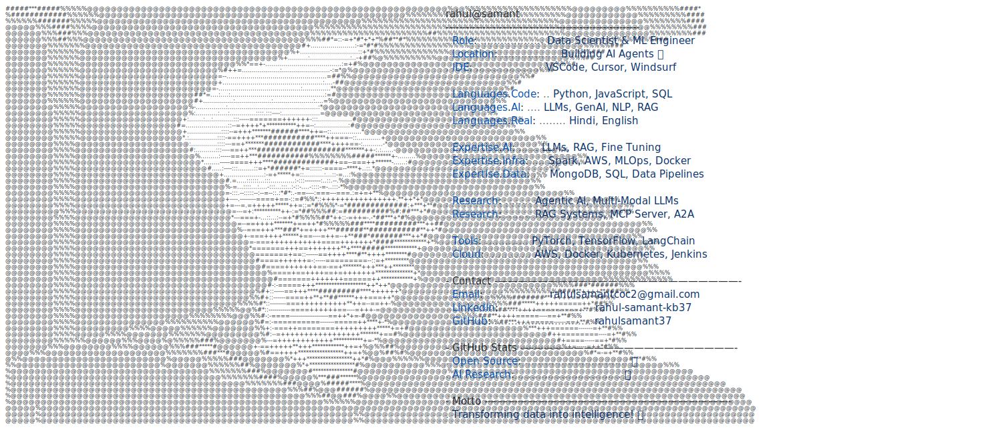

<!-- Typing Effect -->

 

<h3 align="center">⚡ Engineering High-Performance Systems | Bridging AI, Quant, and R&D</h3>

<!-- Badges -->

  
  
  
  

<!-- ASCII Art Profile -->
<a href="https://github.com/rahulsamant37/rahulsamant37">
  <picture>
    <source media="(prefers-color-scheme: dark)" srcset="./dark_mode.svg">
    
  </picture>
</a>

 

## 🔭 Current Trajectory

- 🎓 **Academia:** Pursuing my **MTech at IIT Bombay**, diving deep into advanced algorithms and systems architecture.
- 💻 **Fundamentals:** Strong foundation in core CS principles (OS, DBMS, CN, OOPs) honed through rigorous GATE CSE preparation.
- ⚡ **Engineering:** Architecting **Low-Latency Systems** and optimizing core execution logic in C/C++.
- 📈 **Quantitative:** Researching mathematical strategies and building frameworks for **High-Frequency Trading (HFT)**.
- 🧠 **AI & R&D:** Bridging **Deep Learning/LLMs** with pure statistical modeling to build highly scalable infrastructure.

## 🛠️ Technology Arsenal

| Domain | Technologies |
| :--- | :--- |
| **Core & Systems** |      |
| **Data & AI** |     |
| **Infrastructure** |     |

 

## 🐍 Activity Matrix

  <picture>
    <source media="(prefers-color-scheme: dark)" srcset="https://raw.githubusercontent.com/rahulsamant37/rahulsamant37/output/github-contribution-grid-snake-dark.svg">
    
  </picture>

## 🤝 Establish Connection

  
  
  

  

